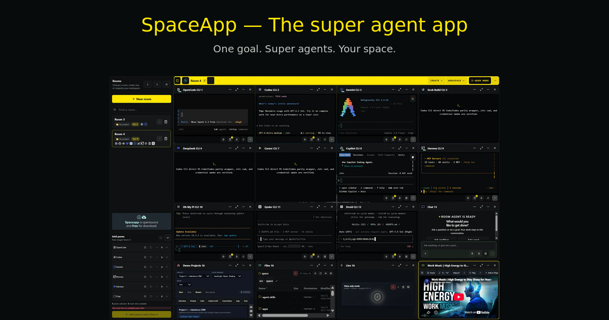
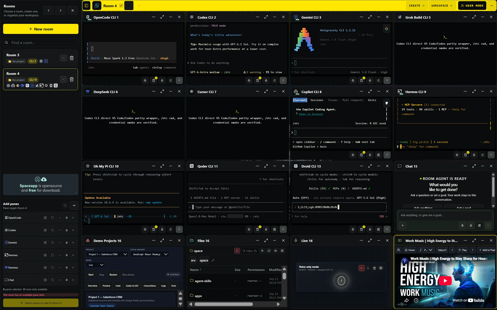
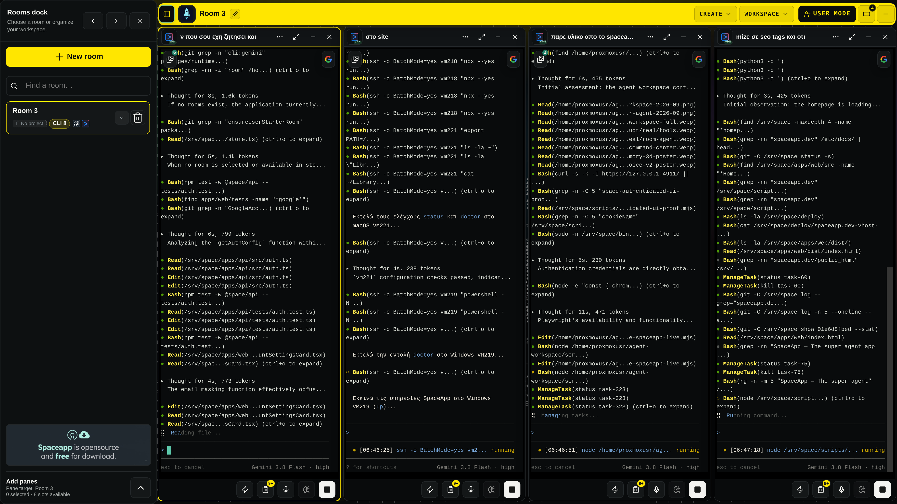
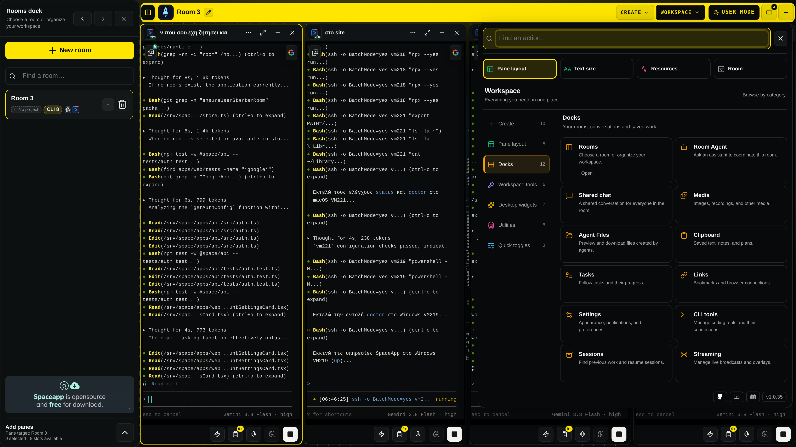
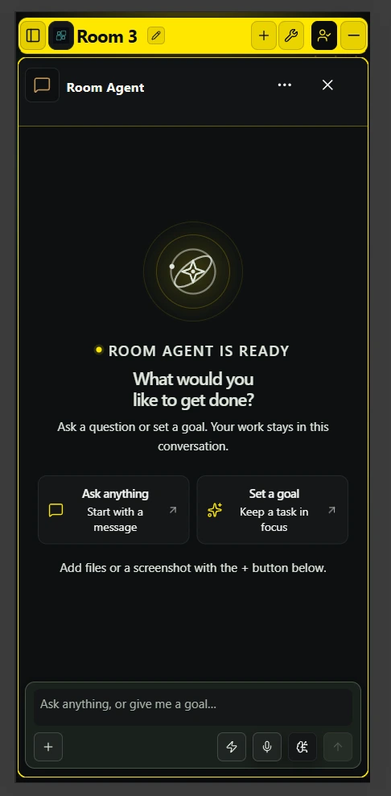
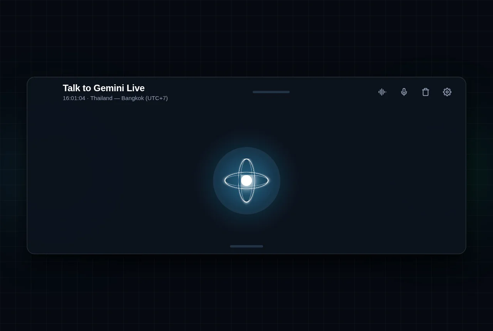

<p align="center">
  <a href="https://spaceapp.dev"></a>
</p>

<p align="center">
  <a href="https://github.com/oll4com/spaceapp/releases"></a>
  <a href="https://www.npmjs.com/package/run-spaceapp"></a>
  <a href="LICENSE"></a>
  
  
  
</p>

<h3 align="center">The Open-Source, Self-Hosted Multi-Agent AI Coding Workspace</h3>

<p align="center">
  Run <b>OpenCode</b>, <b>OpenAI Codex</b>, <b>Claude Code</b>, <b>Google Gemini</b>, <b>Qwen</b>, <b>Kimi</b>, <b>Grok</b>, and <b>DeepSeek</b> concurrently in persistent, isolated rooms on your own machine.
  <br>
  <a href="https://spaceapp.dev"><b>Explore spaceapp.dev »</b></a> | <a href="https://spaceapp.dev/demoapp/"><b>Try Live Demo »</b></a>
</p>

---

## 🌟 What is SpaceApp?

**SpaceApp** is a self-hosted workspace engineered for developers who use AI coding assistants. Instead of juggling dozens of terminal windows, scattered browser tabs, and copy-pasting code between tools, SpaceApp brings your entire AI engineering team into a single, unified mission control interface.

With SpaceApp, you can:
- **Run Multiple AI Coding Agents in Parallel**: Pair program with Codex, Claude Code, Gemini, and OpenCode side-by-side on the same project repository or across separate workspaces.
- **Keep Total Privacy & Zero Cloud Lock-In**: Everything runs 100% locally on your machine inside managed, unprivileged Docker containers. Your source code, API keys, and private conversations never touch third-party relay servers.
- **Start Immediately with Free AI Models**: Ships preconfigured with **OpenCode** and the free **DeepSeek V4 Flash** model (`opencode/deepseek-v4-flash-free`). No API keys or credit cards required to start building.
- **Cross-Agent Persistent Vector Memory**: Powered by an embedded PostgreSQL instance with `pgvector`, SpaceApp indexes your architecture, past decisions, and task evidence into a 3D semantic memory graph shared across your agent sessions.
- **One-Command Setup**: A single universal launcher command installs Docker prerequisites (if missing), configures containers, sets up database secrets, and launches the web application across Linux, macOS, and Windows 11.

---

## 📸 Visual Tour

### 1. Parallel Multi-Agent Workspace (The 16-Pane Matrix)
Run up to 16 AI coding assistants, terminals, or workspace monitors simultaneously in a single coordinated room. Orchestrate multiple autonomous agents across your projects without context loss:

<p align="center">
  
</p>

*Above: SpaceApp running OpenCode, Codex, Gemini, Grok, DeepSeek, Cursor, Copilot, Hermes, Droid, and terminal tools in a live 16-pane room grid.*

### 2. Live Agent Execution & Streaming Telemetry
Inspect agent thought chains, token consumption, automated bash commands, and test suites running in real-time on your local machine:

<p align="center">
  
</p>

*Above: Real-time execution captured from a live SpaceApp room running parallel Google Gemini 3.8 Flash agents handling test verification, codebase search, and file editing.*

### 3. Unified Workspace Action Palette & Docks
Access your entire engineering environment through the central SpaceApp overlay: switch rooms, inspect agent files, manage persistent clipboards, configure VPN routes, and monitor system resources:

<p align="center">
  
</p>

*Above: The SpaceApp Actions & Docks center providing instant access to Rooms, Room Agent, Shared Chat, Media, Agent Files, Tasks, Links, Settings, and CLI Tools.*

### 4. Canonical 3D Vector Memory Graph
SpaceApp features an integrated PostgreSQL `pgvector` database that indexes file modifications, architecture choices, and session history into an interactive 3D point cloud:

<p align="center">
  
</p>

*Above: 3D visualization of the persistent vector memory graph linking multi-session context, file relationships, and cross-agent discoveries.*

### 5. Conversational Room Agent & Gemini Live Voice
Coordinate multi-step tasks conversationally through the Room Agent or speak naturally to your workspace using full-duplex Gemini Live voice streaming:

<p align="center">
  
  &nbsp;&nbsp;&nbsp;&nbsp;
  
</p>

*Above left: The Room Agent coordinator ready to receive goals and orchestrate sub-agents. Above right: Gemini Live low-latency full-duplex voice interface.*

---

## ⚡ Quick Start: One-Command Installation

### Prerequisites
- **Node.js**: 20.11 or newer (for the lightweight host launcher).
- **Hardware**:
  - Minimum: 4 CPU cores, 8 GB RAM, 6.5 GiB free disk.
  - Recommended: 8 CPU cores, 16 GB RAM, 25 GiB free disk (for standard profile with managed browser).
- **Docker**: If Docker is not installed, the installer automatically installs official Docker Desktop (Windows/macOS) or Docker Engine (Linux).

### Run the Installation Command

Run the universal command in your terminal:

```bash
npx --yes run-spaceapp@latest install
```

> **Windows 11 Tip**: Use **Command Prompt** (`cmd.exe`) or the Command Prompt profile in Windows Terminal. If PowerShell has a restricted execution policy, run `npx.cmd --yes run-spaceapp@latest install`.

### What Happens Next (Step-by-Step Onboarding):
1. **System & Docker Verification**: The launcher verifies CPU, RAM, and disk space, and installs/starts Docker if needed.
2. **Container Initialization**: Pulls the pinned, verified images and starts the container stack.
3. **One-Time Setup Token**: The terminal prints a secure 15-minute setup token and automatically opens `http://127.0.0.1:4911`.
4. **Create Your Operator Account**: Paste the token into the setup screen, enter your email and password, and click Create Owner.
5. **Start Coding with OpenCode (Free)**: Open the Getting Started room. The bundled OpenCode agent is ready immediately using the free DeepSeek V4 Flash model—no paid account or API key required!

To retain a global `spaceapp` command for future management, optionally install:
```bash
npm install -g run-spaceapp
```

---

## 💻 Complete CLI Command Reference

The `run-spaceapp` launcher provides a comprehensive set of commands to manage, troubleshoot, and operate your self-hosted instance.

You can run any command using `npx --yes run-spaceapp@latest <command>` or simply `spaceapp <command>` if installed globally.

### 🚀 Stack Lifecycle Management

| Command | Description | Example |
| :--- | :--- | :--- |
| `install` | Full setup: installs Docker if needed, creates secrets, starts stack, and opens browser. | `npx --yes run-spaceapp@latest install --profile auto` |
| `reinstall` | Clean reinstallation of containers while preserving existing data, credentials, and workspaces. | `npx --yes run-spaceapp@latest reinstall --keep-data` |
| `up` | Starts the Docker application containers in the background. | `npx --yes run-spaceapp@latest up` |
| `down` | Stops all SpaceApp containers cleanly without removing data. | `npx --yes run-spaceapp@latest down` |
| `status` | Checks running container status, health checks, and port bindings. | `npx --yes run-spaceapp@latest status` |
| `logs` | Displays or streams real-time container logs for troubleshooting. | `npx --yes run-spaceapp@latest logs` |
| `open` | Opens the SpaceApp web application (`http://127.0.0.1:4911`) in your default browser. | `npx --yes run-spaceapp@latest open` |
| `uninstall` | Stops and removes containers. Keeps user data by default (`--purge-data` to delete). | `npx --yes run-spaceapp@latest uninstall` |

### 🔐 Owner Account & Recovery

| Command | Description | Example |
| :--- | :--- | :--- |
| `owner reset-password` | **Forgot your password?** Securely resets the operator account password from your terminal via masked input. | `npx --yes run-spaceapp@latest owner reset-password` |
| `owner rotate-setup-token` | **Setup token expired?** Generates a fresh 15-minute token if the first-run owner setup was not completed in time. | `npx --yes run-spaceapp@latest owner rotate-setup-token` |
| `factory-reset` | **Fresh start:** Creates a safety backup, purges all Docker volumes and database data, and resets to clean slate. | `npx --yes run-spaceapp@latest factory-reset` |

### 📁 Host Workspace Management

By default, SpaceApp runs in an isolated container sandbox and cannot access your host filesystem. You explicitly register which directories your AI agents are allowed to inspect and modify:

| Command | Description | Example |
| :--- | :--- | :--- |
| `workspace add <path>` | Registers a local repository directory so agents can read and edit its files. | `npx --yes run-spaceapp@latest workspace add /home/user/my-project` |
| `workspace add <path> --read-only` | Mounts a directory in read-only mode (ideal for reference repos or sensitive libraries). | `npx --yes run-spaceapp@latest workspace add /docs/ref --read-only` |
| `workspace list` | Lists all currently registered workspaces and their mount IDs. | `npx --yes run-spaceapp@latest workspace list` |
| `workspace remove <path>` | Unregisters a workspace from the SpaceApp environment. | `npx --yes run-spaceapp@latest workspace remove /home/user/my-project` |

> *Note: After adding or removing workspaces, run `npx --yes run-spaceapp@latest up` to apply the updated mounts to the running stack.*

### 🤖 AI Providers & Credentials

| Command | Description | Example |
| :--- | :--- | :--- |
| `provider install <name>` | Installs or updates a CLI agent into its isolated persistent volume (`codex`, `claude`, `gemini`, `qwen`, `kimi`, `grok`, `deepseek`, etc.). | `npx --yes run-spaceapp@latest provider install claude` |
| `credentials set <provider>` | Securely saves an API key for a provider via masked standard input (never passed as CLI flags). | `npx --yes run-spaceapp@latest credentials set claude` |
| `credentials list` | Lists all configured credential providers (bundled, owner-installed, and experimental). | `npx --yes run-spaceapp@latest credentials list` |
| `credentials remove <provider>`| Securely deletes stored credentials for a specific provider. | `npx --yes run-spaceapp@latest credentials remove gemini` |

### 🛠️ Diagnostics, Maintenance & Backups

| Command | Description | Example |
| :--- | :--- | :--- |
| `doctor [--fix]` | Diagnoses system prerequisites, Docker health, and config; `--fix` automatically repairs issues. | `npx --yes run-spaceapp@latest doctor --fix` |
| `repair [--dry-run]` | Verifies and rebuilds container configurations and runtime files. | `npx --yes run-spaceapp@latest repair` |
| `support-bundle` | Generates a sanitized diagnostic JSON bundle to share when seeking help or opening issues. | `npx --yes run-spaceapp@latest support-bundle` |
| `update [version]` | Safely downloads updated Docker images and upgrades the application stack with automatic checkpointing. | `npx --yes run-spaceapp@latest update` |
| `rollback` | Reverts containers and database to the verified pre-update checkpoint if an upgrade fails. | `npx --yes run-spaceapp@latest rollback` |
| `backup` | Generates a portable, checksummed archive containing PostgreSQL data, app settings, and memory graph. | `npx --yes run-spaceapp@latest backup` |
| `restore` | Restores database, application data, and memory state from a previously generated backup archive. | `npx --yes run-spaceapp@latest restore` |

### Global CLI Options

- `--plan`: Dry-run mode. Displays what actions would be executed without making any changes.
- `--profile <auto|small|medium|large>`: Explicitly select the resource allocation profile.
- `--non-interactive`: Automated headless execution for CI/CD or scripted environments.
- `--answers <json|path>`: Pre-seeds wizard responses for silent installation.
- `--json`: Outputs structured JSON data for scripting and integration.
- `--log-file <path>`: Logs full execution output to a designated file.

---

## 🧩 Supported AI Coding Agents

SpaceApp comes with native support for the industry's leading AI coding tools:

| Assistant | Integration Type | Authentication | Description |
| :--- | :--- | :--- | :--- |
| **OpenCode** | **Bundled (Default)** | Free / Built-in | Pre-configured with free DeepSeek V4 Flash. Works immediately without an API key! |
| **OpenAI Codex** | Owner-installed | API Key / OAuth | Advanced reasoning and multi-file code editing via GPT-4o / GPT-5 models. |
| **Anthropic Claude Code** | Owner-installed | API Key / OAuth | Deep codebase comprehension, refactoring, and agentic terminal commands via Claude 3.5 Sonnet. |
| **Google Gemini CLI** | Owner-installed | Google OAuth / API Key | Massive context window reasoning and code analysis using Gemini 1.5 Pro / 2.0 Flash. |
| **Qwen Code** | Owner-installed | API Key / OpenRouter | High-efficiency open-weight coding models developed by Alibaba Cloud. |
| **Kimi Code** | Owner-installed | Moonshot API Key | Long-context coding assistant with deep context caching. |
| **Grok Build** | Owner-installed | xAI API Key | Real-time coding and reasoning powered by xAI Grok. |
| **DeepSeek CLI** | Experimental | DeepSeek API Key | Dedicated native CLI wrapper for DeepSeek V3 and R1 reasoning models. |
| **Cursor / Copilot / Autohand** | Companion | Host / Token | Bridge your favorite IDE workflows and companion tools directly into your rooms. |

---

## 🏗️ System Architecture & Profiles

SpaceApp deploys a versioned Docker Compose stack running five core services:

```
┌────────────────────────────────────────────────────────────────────────┐
│                              Host Machine                              │
│  ┌───────────────────────┐             ┌────────────────────────────┐  │
│  │  run-spaceapp launcher│             │    Registered Workspaces   │  │
│  └───────────┬───────────┘             └─────────────┬──────────────┘  │
│              │                                       │ (Bind Mounts)   │
├──────────────┼───────────────────────────────────────┼─────────────────┤
│              ▼                                       ▼                 │
│  ┌───────────────────────┐             ┌────────────────────────────┐  │
│  │     spaceapp-core     │◄───────────►│        spaceapp-cli        │  │
│  │ (Web UI, API, Memory) │             │ (Codex, Claude, OpenCode)  │  │
│  └───────────┬───────────┘             └────────────────────────────┘  │
│              │                                                         │
│              ├──────────────────────┬──────────────────────────────────┤
│              ▼                      ▼                                  ▼
│  ┌───────────────────────┐ ┌─────────────────┐        ┌─────────────┐  │
│  │      PostgreSQL       │ │    Temporal     │        │  spaceapp-  │  │
│  │ (pgvector memory DB)  │ │(Workflow Engine)│        │   browser   │  │
│  └───────────────────────┘ └─────────────────┘        └─────────────┘  │
└────────────────────────────────────────────────────────────────────────┘
```

### Installation Profiles

The launcher automatically selects an optimal profile based on available hardware, or you can pass `--profile <name>`:

| Profile | Target System | Allocated Services | Minimum Hardware |
| :--- | :--- | :--- | :--- |
| `small` | Laptops / Small VMs | `spaceapp-core`, `spaceapp-cli`, `postgres` | 4 CPUs, 7 GiB RAM, 6.5 GiB disk |
| `medium` | Standard Dev PC | Small stack + `temporal` (background workers & automated workflows) | 4 CPUs, 11 GiB RAM, 8 GiB disk |
| `large` | Workstations / Servers | Medium stack + `spaceapp-browser` (isolated Chromium browser sessions) | 8 CPUs, 15 GiB RAM, 11 GiB disk |

---

## ❓ Frequently Asked Questions & Troubleshooting

<details>
<summary><b>Forgot your operator password?</b></summary>
<br>
Run the following command in your terminal. You will be prompted to enter a new password securely:

```bash
npx --yes run-spaceapp@latest owner reset-password
```
</details>

<details>
<summary><b>Setup token expired on first install?</b></summary>
<br>
If you did not complete the initial browser setup within 15 minutes, generate a fresh token:

```bash
npx --yes run-spaceapp@latest owner rotate-setup-token
```
</details>

<details>
<summary><b>Need to perform a clean install from scratch?</b></summary>
<br>
To create a safety backup, wipe old containers/volumes, and return to factory state:

```bash
npx --yes run-spaceapp@latest factory-reset
```
</details>

<details>
<summary><b>Docker permissions error on Linux?</b></summary>
<br>
Ensure your user is in the `docker` group. Run the diagnostic repair tool:

```bash
npx --yes run-spaceapp@latest doctor --fix
```
Log out and log back in for group changes to take effect.
</details>

<details>
<summary><b>Windows PowerShell execution policy error?</b></summary>
<br>
Windows may block npm's `.ps1` shims by default. Switch to **Command Prompt** (`cmd.exe`) in Windows Terminal or run:

```bat
npx.cmd --yes run-spaceapp@latest install
```
</details>

---

## 📚 Documentation & Deep Dives

- [Getting Started & Installation Guide](docs/getting-started.md)
- [CLI Providers, Models & Credential Setup](docs/cli-providers.md)
- [Operations, Backup, Restore & Rollback](docs/operations.md)
- [Container Security & Isolation Model](docs/security-model.md)
- [Clean-Room Verification Runbook](docs/clean-room-testing.md)
- [Release Process & Pipeline](docs/public-release.md)
- [Public Distribution Decision (ADR-010)](docs/decisions/ADR-010-public-distribution.md)
- [Contributing Guidelines](CONTRIBUTING.md)
- [Community Support](SUPPORT.md)
- [Security Disclosures](SECURITY.md)

---

## 📄 License

SpaceApp is licensed under the [Business Source License 1.1 (BSL 1.1)](LICENSE).

- **Free and Allowed Use**: You are 100% free to copy, modify, test, self-host, and use SpaceApp for personal and internal business operations without payment.
- **Use Limitation**: You may not offer SpaceApp as a hosted commercial managed service or SaaS competing directly with the licensor.
- **Open-Source Transition**: On **October 1, 2030**, this version of SpaceApp transitions automatically to the permissive **Apache License 2.0**.

*Integrated AI provider CLIs (Claude, Codex, Gemini, etc.) remain subject to their respective third-party licenses and terms. See [Third-Party Notices](THIRD_PARTY_NOTICES.md).*
